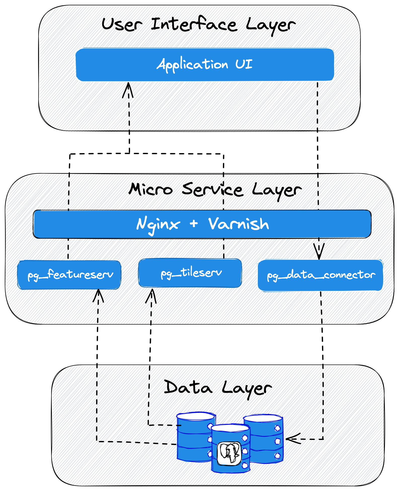

# EAHW Postgis for the Web Services

Configuration and instructions to run EAHW PostGIS for the Web Services

## Introduction

Postgis for the web includes a set of micro-service components that provide HTTP-level access to data in a spatial database with minimal middleware complexity. 
These microservices share a common PostGIS database, but provide different spatial functionalities.

The components include:

- **[pg_data_connector](https://github.com/icpac-igad/pg-data-connector)** - Provides an API inteface for importing geospatial data into a postgis database. Currently supports Geojson and Esri Shapefiles

- **pg_db** - The postgres/postgis database container for storing spatial vector datasets. This is the shared database that will be accessed by both **pg_featureserv** and **pg_tileserv.**  The pg_data_connector API will save the spatial files to this database

- **[pg_featureserv](https://github.com/CrunchyData/pg_featureserv)** - Provides GeoJSON feature services for reading and writing vector and attribute data from tables

- **[pg_tileserv](https://github.com/CrunchyData/pg_tileserv)** - Provides MVT tiles for interactive clients and smooth rendering

- **[varnish](https://github.com/docker-library/docs/tree/master/varnish)** - An HTTP proxy caching layer that stands in between the tile server and clients to reduce database load and increase application performance.


The following diagram illustrates how the services interact:



- The **data layer** contains the postgis database where all the spatial data is stored.
- The **micro service layer** consists of the services that interact directly with the data layer. This is where the business logic of interacting with the database is defined. Normaly, the interaction starts with using the **pg_data_connector** API to upload data to the database. `pg_featureserv` and `pg_tileserv` can then be used to access and serve the data to the application user interface.

- The **user interface layer** provides an interface for interacting with the data as rendered from the database.

## Dependencies
Execution requires:

[Docker](https://www.docker.com/)
[Docker Compose](https://docs.docker.com/compose/)

## Installation
1. Start by cloning the repository from github to your execution environment
    ```
    git clone https://github.com/icpac-igad/eahw-pg4w.git
    cd eahw-pg4w
    ```

2. Create and update your `.env` file. You can find an example `.env.sample` file in the project root. The variables are described in detail in [this section](#environment-variables) of the documentation.

## Environment Variables
- PORT=> public port for nginx
- DB_NAME=> database name
- DB_USER=> database user
- DB_PASSWORD=> database password
- DB_EXTERNAL_PORT=> port to access db remotely
- PG_SERVICE_USER=> name for user with read only prilivileges. Will be used by `pg_featureserv` and `pg_tileserv` to access the database securely. [Refer here](https://access.crunchydata.com/documentation/pg_tileserv/1.0.3/usage/security/) for details on security
- PG_SERVICE_USER_PASSWORD=> password for user with read only priviliges.
- PG_SERVICE_SCHEMA=> schema where all the data will be store
- RESTART_POLICY=> restart policy for docker images

For the variables below, please consult the postgres configuration settings

- SHARED_BUFFERS=
- EFFECTIVE_CACHE_SIZE=
- MAX_WORKER_PROCESSES=
- MAX_PARALLEL_WORKERS=